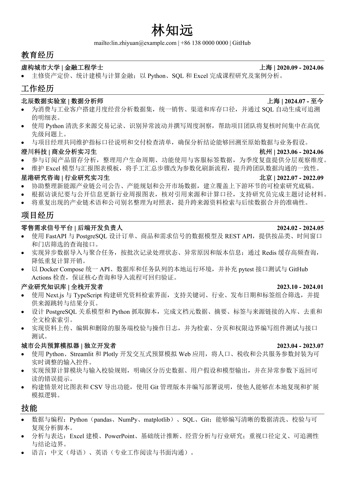
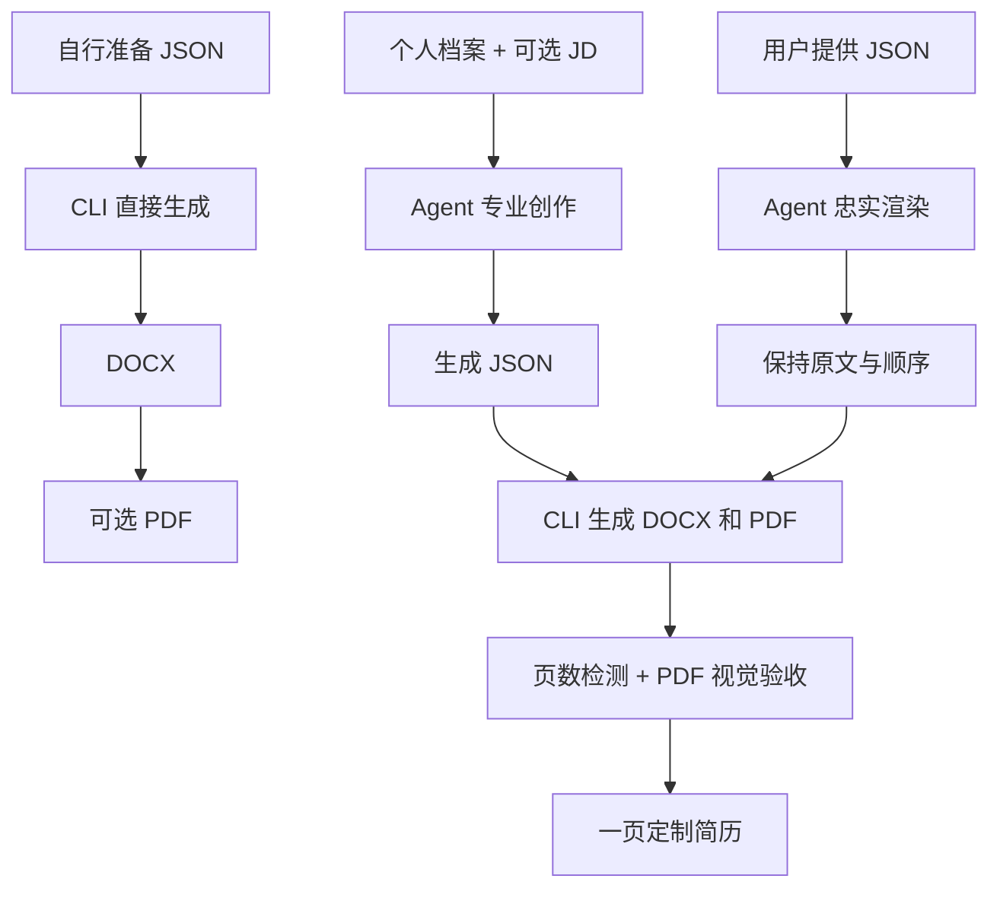

<h1 align="center">📄 JSON-Resume</h1>

<p align="center"><strong>准备 JSON，生成你的简历。</strong></p>

<p align="center">
  <a href="https://jsoncv.cn/" title="打开 JSON CV 在线编辑器">
    
  </a>
</p>

<p align="center"><sub>无需安装 · 在浏览器中编辑、实时预览并导出 Word 简历</sub></p>

<p align="center">
  <sub>✦</sub>
  <strong>支持接入</strong>
  <a href="SKILL.md"><kbd>🤖 AI Agent</kbd></a>
  <sub>·</sub>
  <code>Codex</code>
  <code>OpenClaw</code>
  <code>WorkBuddy</code>
  <sub>✦</sub>
</p>

<p align="center">
  
  <a href="https://pypi.org/project/json-resume/"></a>
  <a href="https://pypi.org/project/json-resume/"></a>
  
  <a href="SKILL.md"></a>
  <a href="https://github.com/Eric-Zhou-0302/Offer-Rain" title="打开 Offer-Rain"></a>
</p>


<p align="center">
  <a href="#简历风格">简历风格</a> ·
  <a href="#如何使用">如何使用</a> ·
  <a href="#项目结构">项目结构</a> ·
  <a href="#工作流">工作流</a> ·
  <a href="#协议">协议</a> ·
  <a href="#搭配-offer-rain">搭配 Offer-Rain</a>
</p>

<p align="center">中文 | <a href="README_EN.md">English</a></p>

<div align="center">
  
</div>

---

写简历的麻烦不该是手调 Word、复制格式和担心改坏旧文件。JSON-Resume 把简历内容写成一份严格的 JSON，生成器负责 Word 的样式、项目符号、链接和双栏排版，最后生成沉稳克制风格的 DOCX 简历。

# 简历风格

- 低装饰、重内容
- 黑白、克制
- 高密度、强层级
- 适用：金融机构、学术研究、技术岗位等
- 简历所用样式详见 [完整样式规范](docs/ARCHITECTURE.md#完整样式规范)

<div align="center">
  <p>生成简历预览</p>
  <a href="assets/example/example_resume_zh.pdf">
    
  </a>
  <p>
    <a href="assets/example/example_resume_zh.docx">查看对应 DOCX</a> ·
    <a href="assets/example/example_resume_zh.json">查看对应 JSON</a>
  </p>
</div>

# 如何使用

JSON-Resume 提供三种使用方式：让 Agent 制作、通过命令行生成，或在 Python 脚本中调用。

也可以直接前往 [JSON CV 在线体验网站](https://jsoncv.cn/)，在浏览器中编辑、预览并导出 Word 简历。

## 面向 Agent 的简历工作流

项目内置 `SKILL.md`，可供 Codex、OpenClaw、WorkBuddy 等 Agent 使用，用于制作或渲染简历。

- 提供已写好的 JSON，交给 Agent 渲染简历
- 提供简历内容，交给 Agent 制作简历

### 安装 Skill

直接把下面这段话发给 Agent：

```text
安装这个 Skill，用于帮我制作简历：
https://github.com/Eric-Zhou-0302/JSON-Resume
```

### 最佳工作流

不要反复在上一份简历上删改，更不要把所有经历塞进同一份“万能简历”。

#### 个人档案

先维护一份完整的 Markdown 或 txt 格式的个人档案，记录教育、工作、项目等个人信息，作为简历内容的来源。

#### 岗位匹配

每次投递时，再把目标岗位的 JD 交给 Agent，Agent 将严格按照档案的内容，最大化突出个人的优势，为这个岗位定制最贴合的一版简历。

### Agent 的交付标准

项目的 Skill 不只是把文字塞进 Word；它负责从事实材料到最终简历的完整交付，并遵守以下标准：

- **一页简历标准**：在专业创作模式下，Agent 会根据目标岗位筛选和精简内容，最终输出恰好一页、信息密度自然的简历；内容过多时优先删除较弱或重复的信息，内容不足时只从已授权的档案补充事实。
- **完整验收**：Agent 必须通过项目 CLI 生成 DOCX 和 PDF，先检查 PDF 实际页数，再逐页检查裁切、重叠、表格对齐、换行、字符和留白，不能只生成文件就宣称完成。
- **事实边界**：Agent 只使用你提供或明确授权读取的档案、旧简历和项目材料；不会捏造经历、日期、职位、成绩、指标、技能或联系方式。JD 只能帮助选择和表达，不能成为个人事实的来源。
- **文件保护**：未经明确授权，Agent 不会覆盖既有 JSON、DOCX 或 PDF。
- **直接提供 JSON 时**：Agent 只负责渲染，会保留内容和顺序，不会改写或删减。

## 命令行与 Python

### 填写 JSON

创建一份 JSON 文件，根据 JSON 契约填写简历内容，具体可参考 [示例 JSON 文件](assets/example/example_resume_zh.json)。

<details>
<summary><strong>展开查看 JSON 契约</strong></summary>

<br />

| 字段 | 规则                                                                                                                       |
| --- |----------------------------------------------------------------------------------------------------------------------------|
| `paper_size` | 必填：`A4` 或 `Letter`。仅决定 Word 页面规格；不会翻译内容。                         |
| `basics` | 必须且只能包含 `name` 与 `contacts`。                                                                                      |
| `contacts` | 至少一项。`label` 是显示文字，`href` 是可选链接目标；邮箱/电话需要自行写完整 `mailto:` / `tel:`。                          |
| `sections` | 至少包含一个 section，按 JSON 顺序输出。每个 section 只能有 `title` 和 `entries`；`title` 必须非空白，`entries` 至少一项。 |
| `entries` | 每个条目至少包含一项非空的`title`、`position`、`location`、`start_date` / `end_date` 或 `bullets`。                         |
| `bullets` | 可省略；提供时必须是至少包含一条非空字符串的扁平 `list[str]`。不支持嵌套列表、对象或从前缀推断层级。                       |

日期必须是有效的 `YYYY-MM`。`end_date` 也可使用 `Present`、`至今` 等状态文本；真实日期范围会显示成 `YYYY.MM - YYYY.MM`。

</details>

### 渲染简历

简历 JSON 可以通过以下三种方式生成 DOCX 或 PDF。

#### 通过已安装的包在命令行生成

```bash
pip install json-resume
json-resume resume.json
```

#### 脚本内渲染

安装 pip 包后，也可通过导入 `render_json_file_to_docx()` 在 Python 脚本中渲染简历。

```python
from resume_generator import render_json_file_to_docx

docx_path = render_json_file_to_docx(
    "resume.json",
    "resume.docx",
)

print(docx_path)
```

#### `main.py` 入口

```bash
pip install -r requirements.txt
python main.py resume.json
```

#### 命令行参数

`json-resume` 与 `python main.py` 都支持以下参数：

```bash
-o OUTPUT, --output OUTPUT  # 指定输出位置与文件名
--pdf              # 生成 PDF
--force            # 覆盖已有文件
```

Python 接口使用 `output_path`、`pdf=True` 和 `force=True` 传入对应设置。

# 项目结构

```text
JSON-Resume/
├── README.md                          # 中文用户文档
├── README_EN.md                       # English documentation
├── CHANGELOG.md                       # 版本更新记录
├── SKILL.md                           # 内置 SKILL，面向 Agent 使用
├── LICENSE                            # MIT 协议
├── MANIFEST.in                        # 源码发行包内容边界
├── PYPI.md                            # PyPI 项目页说明
├── main.py                            # CLI 入口
├── pyproject.toml                     # 包元数据、依赖与安装命令入口
├── requirements.txt                   # Python 依赖
├── assets/
│   ├── example/                       # 示例 JSON、DOCX、PDF 与预览图
│   ├── buy-me-a-coffee.jpg
│   └── json-resume-hero.png
├── docs/
│   └── ARCHITECTURE.md                # 开发者架构文档
├── resume_generator/
│   ├── cli.py                         # 命令行参数与主流程
│   ├── validator.py                   # JSON 校验与模型解析
│   ├── renderer.py                    # DOCX 内容渲染
│   ├── styles.py                      # 页面、样式和表格规范
│   ├── layout.py                      # 条目双栏版式
│   ├── helpers.py                     # OOXML、链接和字体工具
│   ├── config.py                      # 纸张规格配置
│   ├── models.py                      # 纯数据模型
│   ├── output.py                      # 输出目标检查与原子写入
│   ├── service.py                     # 内存与文件级公共服务接口
│   └── pdf.py                         # PDF 导出与页数检测
└── tests/                             # 测试
```

# 工作流



# 搭配 Offer-Rain

JSON-Resume 专注于制作简历，不负责投递。若你需要以邮箱方式投递你的简历，可使用 [Offer-Rain](https://github.com/Eric-Zhou-0302/Offer-Rain)。

# 协议

[MIT](./LICENSE) @ 2026 Eric Zhou

---

# 请作者喝杯咖啡

<div align="center">
  <p>
    如果这个项目帮你完成了第一份、第五份，或者第五十份简历，
    <br />
    欢迎请作者喝杯咖啡。
  </p>
  <p>
    愿你的下一份简历，把真实经历讲得清楚、排得漂亮，
    <br />
    而我的杯子里也能顺便续上一点热美式。
  </p>
  
  <p>
    <sub>自愿支持，不影响功能使用，也不影响你继续生成简历。</sub>
  </p>
</div>

---
