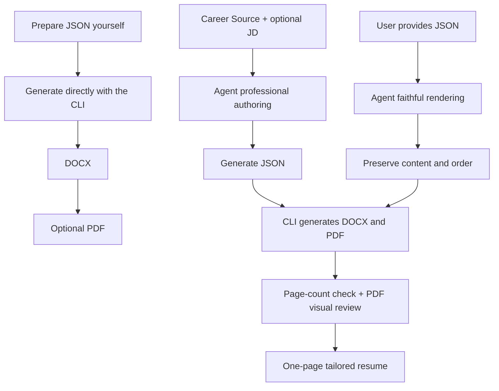

<h1 align="center">📄 JSON-Resume</h1>

<p align="center"><strong>Prepare JSON. Generate your resume.</strong></p>

<p align="center">
  <sub>✦</sub>
  <strong>Works with</strong>
  <a href="SKILL.md"><kbd>🤖 AI Agent</kbd></a>
  <sub>·</sub>
  <code>Codex</code>
  <code>OpenClaw</code>
  <code>WorkBuddy</code>
  <sub>✦</sub>
</p>

<p align="center">
  
  <a href="https://pypi.org/project/json-resume/"></a>
  <a href="https://pypi.org/project/json-resume/"></a>
  
  <a href="SKILL.md"></a>
  <a href="https://github.com/Eric-Zhou-0302/Offer-Rain" title="Open Offer-Rain"></a>
</p>

<p align="center">
  <a href="#resume-style">Resume style</a> ·
  <a href="#how-to-use">How to use</a> ·
  <a href="#project-structure">Project structure</a> ·
  <a href="#workflow">Workflow</a> ·
  <a href="#license">License</a> ·
  <a href="#pair-with-offer-rain">Pair with Offer-Rain</a>
</p>

<p align="center"><a href="README.md">中文</a> | English</p>

<div align="center">
  
</div>

---

Writing a resume should not mean hand-tuning Word, copying formatting, or worrying about breaking the last good file. JSON-Resume stores resume content in strict JSON while the generator handles Word styles, bullets, links, and a two-column layout—then produces a composed, restrained DOCX resume.

# Resume style

- Minimal decoration, content first
- Monochrome and restrained
- High information density with a clear hierarchy
- Well suited to finance, academic research, technical roles, and similar applications
- See the [full style specification](docs/ARCHITECTURE.md#完整样式规范)

<div align="center">
  <p>Generated resume preview</p>
  <a href="assets/example/example_resume_en.pdf">
    
  </a>
  <p>
    <a href="assets/example/example_resume_en.docx">View the DOCX</a> ·
    <a href="assets/example/example_resume_en.json">View the JSON</a>
  </p>
</div>

# How to use

JSON-Resume offers three ways to work: have an Agent create a resume, generate one from the command line, or call it from a Python script.

## Agent-assisted resume workflow

The project includes `SKILL.md`, which Codex, OpenClaw, WorkBuddy, and other compatible Agents can use to create or render resumes.

- Give an existing JSON file to an Agent and have it render the resume.
- Give resume materials to an Agent and have it create the resume.

### Install the Skill

Send this directly to your Agent:

```text
Install this Skill to help me create my resume:
https://github.com/Eric-Zhou-0302/JSON-Resume
```

### A better workflow

Do not repeatedly edit the previous resume. And do not cram every experience into one universal resume.

#### Career source

Maintain a complete personal Career Source in Markdown or plain text: education, employment, projects, and other career facts. It is the source material for each resume.

#### Role tailoring

For each application, give the target job description to the Agent. It will use only the facts in the Career Source, foregrounding your most relevant strengths to create the best-fitting resume for that role.

### Agent delivery standard

The Skill does more than put text into Word. It owns the complete delivery path from factual material to the final resume and follows these standards:

- **One-page resume standard:** In professional authoring mode, the Agent selects and refines content for the target role, producing a naturally dense resume of exactly one page. If content is excessive, it removes weaker or repetitive information first; if content is thin, it only adds facts from authorized source materials.
- **Full acceptance:** The Agent must generate the DOCX and PDF through the CLI, check the actual PDF page count, and inspect every page for clipping, overlap, table alignment, line breaks, characters, and whitespace. Creating files alone is not completion.
- **Factual boundary:** The Agent uses only materials you provide or explicitly authorize: Career Sources, prior resumes, and project records. It does not invent experience, dates, titles, grades, metrics, skills, or contact details. A job description may guide selection and wording, but is never evidence of personal facts.
- **File protection:** Without explicit authorization, the Agent does not overwrite existing JSON, DOCX, or PDF files.
- **When you provide JSON directly:** The Agent only renders it, preserving its content and order without rewriting or removing anything.

## Command line and Python

### Write the JSON

Create a JSON file and fill in your resume content according to the JSON contract. See the [example JSON file](assets/example/example_resume_en.json).

<details>
<summary><strong>Expand to view the JSON contract</strong></summary>

<br />

| Field | Rule |
| --- | --- |
| `paper_size` | Required: `A4` or `Letter`. It selects the Word page size only and does not translate content. |
| `basics` | Must contain exactly `name` and `contacts`. |
| `contacts` | At least one item. `label` is visible text and `href` is an optional link target; provide complete `mailto:` / `tel:` values yourself. |
| `sections` | Contains at least one section and renders in JSON order. Each section may contain only `title` and `entries`; `title` must be nonblank and `entries` needs at least one item. |
| `entries` | Each entry needs at least one nonblank `title`, `position`, `location`, `start_date` / `end_date`, or `bullets`. |
| `bullets` | Optional; when present, a flat `list[str]` with at least one nonblank string. Nested lists, objects, and hierarchy inferred from prefixes are not supported. |

Dates must be valid `YYYY-MM` values. `end_date` may also use status text such as `Present`; calendar date ranges render as `YYYY.MM - YYYY.MM`.

</details>

### Render the resume

You can generate a DOCX or PDF from a resume JSON in three ways.

#### Run the installed package from the command line

```bash
pip install json-resume
json-resume resume.json
```

#### Render in a Python script

After installing the package, import `render_json_file_to_docx()` to render a resume in a Python script.

```python
from resume_generator import render_json_file_to_docx

docx_path = render_json_file_to_docx(
    "resume.json",
    "resume.docx",
)

print(docx_path)
```

#### `main.py` entry point

```bash
pip install -r requirements.txt
python main.py resume.json
```

#### Command-line options

Both `json-resume` and `python main.py` support:

```bash
-o OUTPUT, --output OUTPUT  # Set the output path and filename
--pdf                        # Generate a PDF
--force                      # Replace existing output files
```

The Python API accepts the corresponding `output_path`, `pdf=True`, and `force=True` arguments.

# Project structure

```text
JSON-Resume/
├── README.md                          # Chinese user documentation
├── README_EN.md                       # English user documentation
├── CHANGELOG.md                       # Release notes
├── SKILL.md                           # Built-in Skill for Agents
├── LICENSE                            # MIT License
├── MANIFEST.in                        # Source-distribution content boundary
├── PYPI.md                            # PyPI project description
├── main.py                            # Traditional CLI entry point
├── pyproject.toml                     # Package metadata, dependencies, and installed command
├── requirements.txt                   # Python dependencies
├── assets/
│   ├── example/                       # Example JSON, DOCX, PDF, and preview images
│   ├── buy-me-a-coffee.jpg
│   └── json-resume-hero.png
├── docs/
│   └── ARCHITECTURE.md                # Developer architecture documentation
├── resume_generator/
│   ├── cli.py                         # Command-line arguments and main flow
│   ├── validator.py                   # JSON validation and model parsing
│   ├── renderer.py                    # DOCX content rendering
│   ├── styles.py                      # Page, style, and table specifications
│   ├── layout.py                      # Two-column entry layout
│   ├── helpers.py                     # OOXML, link, and font helpers
│   ├── config.py                      # Paper-size configuration
│   ├── models.py                      # Pure data models
│   ├── output.py                      # Output-target checks and atomic writes
│   ├── service.py                     # In-memory and file-level public service APIs
│   └── pdf.py                         # PDF export and page-count check
└── tests/                             # Tests
```

# Workflow



# Pair with Offer-Rain

JSON-Resume focuses on creating resumes, not sending applications. If you need to apply by email, use [Offer-Rain](https://github.com/Eric-Zhou-0302/Offer-Rain).

# License

[MIT](./LICENSE) @ 2026 Eric Zhou

---

# Buy the author a coffee

<div align="center">
  <p>
    If this project helped you finish your first, fifth, or fiftieth resume,
    <br />
    consider buying the author a coffee.
  </p>
  <p>
    May your next resume tell your real experience clearly and look great,
    <br />
    while my cup gets a small refill of hot Americano.
  </p>
  
  <p>
    <sub>Entirely optional. It does not affect features or your ability to keep generating resumes.</sub>
  </p>
</div>

---
