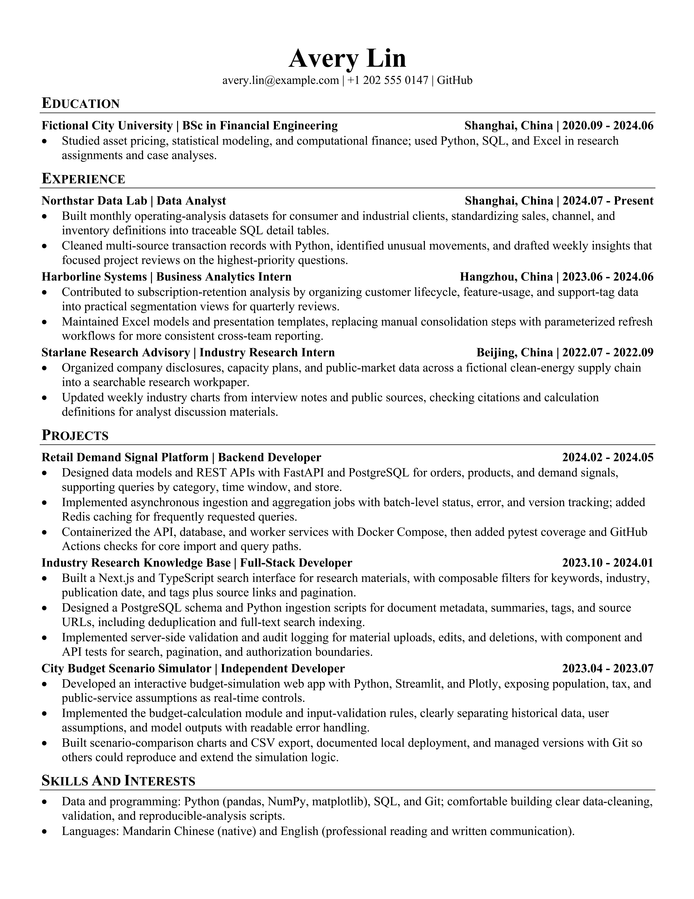
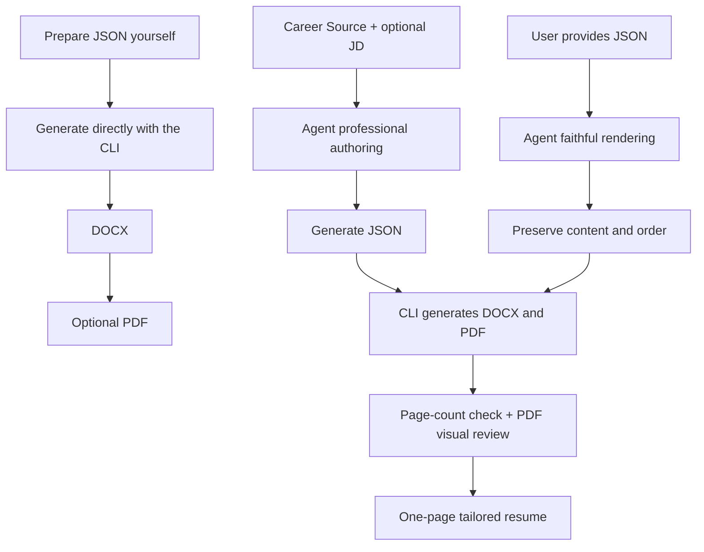

<p align="center"><a href="README.md">中文</a> | English</p>

<div align="center">
  
</div>

<h1 align="center">📄 JSON-Resume</h1>

<p align="center"><strong>Prepare JSON. Generate your resume.</strong></p>

<p align="center">
  <sub>✦</sub>
  <strong>Works with</strong>
  <a href="SKILL.md"><kbd>🤖 AI Agents</kbd></a>
  <sub>·</sub>
  <code>Codex</code>
  <code>OpenClaw</code>
  <code>WorkBuddy</code>
  <sub>✦</sub>
</p>

<p align="center">
  
  
  <a href="SKILL.md"></a>
</p>

<p align="center">
  <a href="#resume-style">Resume style</a> ·
  <a href="#how-to-use">How to use</a> ·
  <a href="#agent-delivery-standard">Agent delivery standard</a> ·
  <a href="#project-structure">Project structure</a> ·
  <a href="#workflow">Workflow</a> ·
  <a href="#license">License</a>
</p>

---

Writing a resume should not mean hand-tuning Word, copying formats, or worrying about damaging the last good file. JSON-Resume keeps resume content in strict JSON while the generator handles Word styles, bullets, links, and two-column layout—then produces a composed, restrained DOCX resume.

# Resume style

- Minimal decoration, content first
- Monochrome and restrained
- High information density with a clear hierarchy
- Well suited to finance, academic research, technical roles, and similar applications
- See the [full style specification](docs/ARCHITECTURE.md#完整样式规范)

<div align="center">
  <p>Generated resume preview</p>
  <a href="assets/example/example_resume_en.pdf">
    
  </a>
  <p>
    <a href="assets/example/example_resume_en.docx">View the DOCX</a> ·
    <a href="assets/example/example_resume_en.json">View the JSON</a>
  </p>
</div>

# How to use

JSON-Resume offers two ways to work.

## An Agent-first resume workflow

This project includes an Agent-facing `SKILL.md`. Use the complete project as a Skill with Codex, OpenClaw, WorkBuddy, or another compatible Agent and let it create your resume.

- Give an existing JSON file to an Agent and have it render the resume.
- Give resume materials to an Agent and have it create the resume.

### Install the Skill

Send this directly to your Agent:

```text
Install this Skill to help me create my resume:
https://github.com/Eric-Zhou-0302/JSON-Resume
```

### A better workflow

Do not repeatedly edit the previous resume. And do not cram every experience into one universal resume.

#### Career Source

Maintain a complete personal Career Source in Markdown or plain text: education, employment, projects, and other career facts. It is the source material for each resume.

#### Role tailoring

For each application, give the target job description to the Agent. It will use only the facts in the Career Source, foregrounding your most relevant strengths to create the best-fitting resume for that role.

## CLI

### Install

```bash
git clone https://github.com/Eric-Zhou-0302/JSON-Resume
cd JSON-Resume
pip install -r requirements.txt
```

### Write the JSON

Create a JSON file and fill in your resume content according to the JSON contract. See `assets/example/example_resume_en.json` for a complete example.

<details>
<summary><strong>Expand to view the JSON contract</strong></summary>

<br />

| Field | Rule |
| --- | --- |
| `locale` | Required: `zh-CN`, `en-US`, `en-GB`, or `en-EU`. It selects paper size only: `en-US` is Letter; the rest are A4. It does not translate content. |
| `basics` | Must contain exactly `name` and `contacts`. |
| `contacts` | At least one item. `label` is visible text and `href` is an optional link target; provide complete `mailto:` / `tel:` values yourself. |
| `sections` | Rendered in JSON order. Each section may contain only `title` and `entries`. |
| `entries` | Only `bullets` is required; `title`, `position`, `location`, `start_date`, and `end_date` are optional. |
| `bullets` | A flat `list[str]` only. Nested lists, objects, and hierarchy inferred from prefixes are not supported. |

Dates must be valid `YYYY-MM` values. `end_date` may also use status text such as `Present`; calendar date ranges render as `YYYY.MM - YYYY.MM`.

</details>

### Render the resume

```bash
python main.py resume.json                   # Render DOCX; defaults to ./output/resume.docx
python main.py resume.json -o OUTPUT.docx    # Specify the output path and filename
python main.py resume.json --pdf             # Also generate a PDF
python main.py resume.json --force           # Replace an existing file
python main.py resume.json --quiet            # Print artifact paths only; suitable for scripts
python main.py resume.json --no-banner        # Hide the interactive terminal logo
```

## Agent delivery standard

The Skill does more than put text into Word. It owns the complete delivery path from factual material to the final resume and follows these standards:

- **One-page completion:** In professional authoring mode, the Agent selects and refines content for the target role, producing a naturally dense resume of exactly one page. If content is excessive, it removes weaker or repetitive information first; if content is thin, it only adds facts from authorized source materials.
- **Full acceptance:** The Agent must generate the DOCX and PDF through the project CLI, check the actual PDF page count, and inspect every page for clipping, overlap, table alignment, line breaks, characters, and whitespace. Creating files alone is not completion.
- **Factual boundary:** The Agent uses only materials you provide or explicitly authorize: Career Sources, prior resumes, and project records. It does not invent experience, dates, titles, grades, metrics, skills, or contact details. A JD may guide selection and wording, but is never evidence of personal facts.
- **Faithful-rendering exception:** If you provide JSON directly, the Agent preserves its content and order without deleting or rewriting it. This mode may produce multiple pages, but the Agent reports the actual page count and layout condition honestly.
- **File protection:** Without explicit authorization, the Agent does not overwrite existing JSON, DOCX, or PDF files.

## Project structure

```text
JSON-Resume/
├── README.md                          # Chinese user documentation
├── README_EN.md                       # English user documentation
├── CHANGELOG.md                       # Release notes
├── SKILL.md                           # Built-in Skill for Agents
├── LICENSE                            # MIT License
├── main.py                            # CLI entry point
├── requirements.txt                   # Python dependencies
├── assets/
│   ├── example/                       # Example JSON, DOCX, PDF, and preview images
│   ├── buy-me-a-coffee.jpg
│   └── json-resume-hero.png
├── docs/
│   └── ARCHITECTURE.md                # Developer architecture documentation
├── resume_generator/
│   ├── cli.py                         # Arguments, output protection, and main flow
│   ├── validator.py                   # JSON validation and model parsing
│   ├── renderer.py                    # DOCX content rendering
│   ├── styles.py                      # Page, style, and table specifications
│   ├── layout.py                      # Two-column entry layout
│   ├── helpers.py                     # OOXML, link, and font helpers
│   ├── config.py                      # Locale and paper configuration
│   ├── models.py                      # Pure data models
│   └── pdf.py                         # PDF export and page-count check
└── tests/                             # Tests
```

## Workflow



## License

[MIT](./LICENSE) @ 2026 Eric Zhou

---

## Buy the author a coffee

<div align="center">
  <p>
    If this project helped you finish your first, fifth, or fiftieth resume,
    <br />
    consider buying the author a coffee.
  </p>
  <p>
    May your next resume tell your real experience clearly and look great,
    <br />
    while my cup gets a small refill of hot Americano.
  </p>
  
  <p>
    <sub>Entirely optional. It does not affect features or your ability to keep generating resumes.</sub>
  </p>
</div>

---
