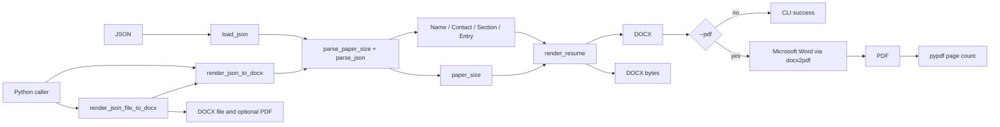

# JSON-Resume 架构文档

本文面向项目维护者，说明稳定边界、模块职责和验收路径。用户如何安装、让 Agent 制作简历或调用 CLI，以 README 为准；Agent 的事实边界与交付要求，以根目录 [SKILL.md](../SKILL.md) 为准。

## 设计目标

JSON-Resume 解决的是“结构化、可校验的简历内容如何稳定落到 Word/PDF”的问题。系统必须同时保证：

- 输入错误在生成前被精确拒绝；
- 相同合法输入能产生可预测的 DOCX 结构与版式；
- Word 的样式、项目符号、链接和表格是真实 Word/OOXML 结构，而非视觉模拟；
- CLI 默认不会覆盖既有交付物；
- PDF 只有在 Microsoft Word 成功导出有效文件后才算成功。



## 稳定边界

### 数据模型不扩张

`models.py` 只定义以下数据结构：

- `Name`
- `Contact`
- `Entry`
- `Section`
- `FieldError`

不得为顶层 JSON 新增 `Resume`、`Basics`、`Bullet` 等包装模型。`parse_json()` 必须保持返回 `(Name, list[Contact], list[Section])` 三元组；页面配置由独立的 `parse_paper_size()` 返回，而不是塞进新的聚合模型。

### JSON 契约严格且单向

顶层只能包含 `paper_size`、`basics`、`sections`。`paper_size` 必填，只支持 `A4`、`Letter`。不得接受别名或大小写归一化。

每个 `Entry` 的字段均为可选，但必须至少包含一项非空白的标题、职位、地点、日期或 bullet。`bullets` 可省略；提供时必须是至少包含一项非空白字符串的扁平 `list[str]`。不支持嵌套结构、对象，也不从 `-`、`•` 等文字前缀推断层级。顶层 `sections` 必须至少包含一个 section；每个 section 需要非空白标题和至少一个 entry。`start_date` 和日期形式的 `end_date` 必须为 ISO `YYYY-MM`；`end_date` 也可为空值或状态文本。解析器内部以当月第一天保存日期，仅用于先后比较和排序。

校验失败必须使用 `FieldError` 报出完整路径，例如 `sections[0].entries[0].bullets[1]`。校验和解析不能改写调用方传入的原始字典。

### 事实与内容的边界

渲染器只处理已经校验的数据模型，不读取原始 JSON，也不决定用户经历的真实性。Agent 的专业创作模式只能使用用户明确提供或授权的事实材料；岗位描述只能影响筛选与表达，不能证明新经历、技能或指标。

### Python 集成接口

`resume_generator.render_json_to_docx(data)` 是面向 HTTP 服务的稳定入口。它接收与 CLI 相同的原始字典，依次调用 `parse_paper_size()`、`parse_json()` 与 `render_resume()`，再把 `Document` 保存到内存并返回 `bytes`。

`resume_generator.render_json_file_to_docx(input_path, output_path=None, *, pdf=False, force=False)` 是面向 Python 脚本的文件级入口。它读取 JSON 文件、执行同一套严格校验、原子写入 DOCX，并返回生成文件的绝对 `Path`；启用 `pdf=True` 时额外写入同名 PDF。`output_path` 省略时写入当前工作目录的 `output/`。

两个接口都不修改输入 JSON，也不包装或翻译 `FieldError`。外部服务应固定 `json-resume` 的 PyPI 版本；运行中的服务使用其部署时安装的明确版本，不动态读取 GitHub `main`。

## 模块分层

```text
main.py
  └── resume_generator.cli
        ├── service.render_json_file_to_docx
        │     ├── validator.py + models.py + config.py
        │     ├── renderer.py
        │     │     ├── styles.py
        │     │     ├── layout.py
        │     │     └── helpers.py
        │     ├── output.py
        │     └── pdf.py             # 仅在 --pdf 时调用
        └── pdf.count_pdf_pages      # 仅在 --pdf 成功后调用

Python caller
  ├── service.render_json_to_docx
  │     ├── validator.py + models.py + config.py
  │     └── renderer.py
  └── service.render_json_file_to_docx
        ├── service.render_json_to_docx
        ├── output.py
        └── pdf.py                 # 仅在 pdf=True 时调用
```

| 模块 | 负责什么 | 不负责什么 |
| --- | --- | --- |
| `main.py` | 传统根目录入口；委托 `resume_generator.cli.main()`。 | 业务逻辑。 |
| `cli.py` | 命令行参数、终端进度/错误呈现、退出码，以及生成后的 PDF 页数报告；委托文件级服务接口完成生成。 | JSON 读取、校验、渲染、文件写入和 PDF 导出。 |
| `validator.py` | UTF-8 JSON 读取、严格字段校验、日期解析、模型转换。 | 页面规格、DOCX 写入、默认值猜测。 |
| `config.py` | 受支持纸张名与尺寸。 | 简历数据模型和内容翻译。 |
| `models.py` | 纯数据对象和字段路径错误。 | 校验、渲染、文件 I/O。 |
| `service.py` | 提供内存 DOCX bytes 接口给 HTTP 服务，以及直接生成 DOCX/PDF 文件的 Python 脚本接口。 | HTTP 路由、响应头、CLI 参数解析和终端输出。 |
| `renderer.py` | 从空白 `Document` 依次写入姓名、联系方式、栏目、条目和 bullet。 | 解释原始 JSON、保存文件、解析 CLI 参数。 |
| `styles.py` | 页面基线、样式注册、编号样式关联、表格样式与实例几何。 | 遍历经历、组织文本、读写 JSON。 |
| `layout.py` | 条目头部的两列表格和单元格内容。 | 重复写入表格视觉属性。 |
| `helpers.py` | 字体槽位、超链接、稳定元数据、边框、编号等 OOXML 原语。 | 业务判断。 |
| `pdf.py` | `docx2pdf` 导出、PDF 存在性/非零字节检查、`pypdf` 页数检测。 | DOCX 渲染与版式判断。 |

## DOCX 渲染架构

### 从空白文档开始

`render_resume()` 每次创建新的 `Document()`，先清除并固定核心元数据，再实例化 `ResumeStyleManager`。不得依赖外部 DOCX 模板，也不得把用户元数据遗留到输出文件中。

`ResumeTheme` 集中保存西文字体、中文字体和颜色；当前基线为 Times New Roman、宋体和黑色。`helpers.set_style_fonts()` 与 `helpers.set_run_fonts()` 都必须显式写入 `w:ascii`、`w:hAnsi`、`w:eastAsia`，避免中英文混排时由 Word 自行替换字体。

### 样式管理器

`ResumeStyleManager` 持有 `Document`、`ResumeTheme` 和纸张配置，并幂等应用：

- 纵向页面、四边 `0.5 in` 页边距；
- 7 个段落样式：`Resume Name`、`Resume Contact Information`、`Resume Section Heading`、`Resume Entry Heading`、`Resume Entry Metadata`、`Resume Bullet`、`Resume Sub Bullet`；
- 1 个表格样式：`Resume Entry Table`；
- Word 现有编号定义 `numId=1`、`numId=3` 与项目样式的关联。

栏目标题的英语单词由渲染器规范为 Title Case，样式通过真正的 `w:smallCaps` 表现 Small Caps；中文保持原文。栏目横线是段落底边框，不是空段落、下划线字符或绘图对象。

### 完整样式规范

除下表中特别说明的项目外，所有段落样式均使用 Times New Roman 作为西文字体、宋体作为中文字体、黑色（`#000000`）、单倍行距，并显式写入 `w:ascii`、`w:hAnsi` 与 `w:eastAsia` 字体槽位。

| 样式名 | 类型 | 字号与字重 | 对齐与间距 | 其他格式 | 用途 |
| --- | --- | --- | --- | --- | --- |
| `Resume Name` | 段落 | 24 pt，加粗 | 居中；段前/段后 0 pt | 无 | 姓名 |
| `Resume Contact Information` | 段落 | 10.5 pt，常规 | 居中；段前/段后 0 pt | 非空 `href` 为黑色单下划线的外部超链接 | 联系方式 |
| `Resume Section Heading` | 段落 | 14 pt，加粗 | 左对齐；段前 6 pt、段后 2 pt | `w:smallCaps`、与下段同页、黑色底边框（size `4`、space `1`） | 区块标题 |
| `Resume Entry Heading` | 段落 | 11 pt，加粗 | 左对齐；段前 2 pt、段后 0 pt | 无 | 条目表格左栏的 `title | position` |
| `Resume Entry Metadata` | 段落 | 11 pt，加粗 | 右对齐；段前 2 pt、段后 0 pt | 无 | 条目表格右栏的 `location | 日期范围` |
| `Resume Bullet` | 段落 | 11 pt，常规 | 左对齐；段前/段后 0 pt | 真实 Word 编号 `numId=1` | 一级 bullet |
| `Resume Sub Bullet` | 段落 | 10.5 pt，常规 | 左对齐；段前/段后 0 pt | 真实 Word 编号 `numId=3`；当前不主动输出 | 预留的二级 bullet |
| `Resume Entry Table` | 表格 | 不直接定义字体；单元格分别使用两种 Entry 段落样式 | 表格水平居中；单元格垂直居中 | 固定布局、无边框、零单元格边距、禁止行跨页拆分；实例列宽固定为左 60% / 右 40% | 条目标题与元信息容器 |

`Resume Entry Table` 的 60/40 列宽不是 Word 表格样式本身能够可靠保存的属性。因此，`ResumeEntryTableStyle.apply()` 在每个表格实例上写入 `tblW`、`tblGrid` 和 `tcW`，使样式定义与实际 OOXML 几何保持一致。

### 条目布局

`layout.add_entry_header_table()` 只负责创建一行两列的内容结构。`ResumeEntryTableStyle` 统一负责无边框、固定布局、水平居中、垂直居中、零单元格边距、禁止行跨页拆分，以及 60/40 的实例列宽。

Word 表格样式不能可靠地保存具体列宽，因此 `ResumeEntryTableStyle.apply()` 在每个实例上根据当前页面可用宽度写入 `tblW`、`tblGrid` 与 `tcW`。不要在 `layout.py` 或 `renderer.py` 重复这些格式。

条目左侧拼接 `title | position`，右侧拼接 `location | 日期范围`；缺失的一侧不产生多余分隔符。日期显示为 `YYYY.MM`，两端都有值时以 ` - ` 相连。

### 链接与项目符号

`Contact.label` 是可见文本，`Contact.href` 为可选目标。非空 `href` 通过 `helpers.add_hyperlink()` 生成黑色单下划线的外部关系；空或纯空白的 `href` 只写普通文本，不带下划线。邮箱和电话目标由输入 JSON 显式给出，生成器不自动补充 `mailto:` 或 `tel:`。

`Resume Bullet` 使用 11 pt 并连接真实 Word 编号定义，不能用 Unicode 圆点代替。`Resume Sub Bullet` 为已注册的 10.5 pt 样式，但 JSON 不生成嵌套 bullet。

## CLI、文件与错误语义

`cli.main()` 的稳定顺序是：解析命令行参数 → 通过 `render_json_file_to_docx()` 生成文件 → （`--pdf` 时）读取实际 PDF 页数并报告结果。文件级服务接口的顺序是：读取输入 → 校验纸张规格/内容并渲染到内存 → 预检 DOCX/PDF 输出目标 → 原子保存 DOCX → 可选导出 PDF。已有 DOCX 或 PDF 不会被覆盖，但会在完成渲染后才报告冲突。

- 未指定 `-o` 时，输出写入当前工作目录的 `output/`，并与输入同名。
- 指定 `-o` 时，父目录必须已经存在；默认输出目录会自动创建。
- DOCX 先保存到同目录临时文件，再用 `os.replace()` 原子替换目标。
- 已存在的目标 DOCX 或本次要生成的 PDF 会在写入前拒绝；只有 `--force` 才允许覆盖。
- 输入文件、JSON 语法或字段校验错误返回 `2`；渲染、输出目录、保存与 PDF 导出错误返回 `1`。

`pdf.convert_docx_to_pdf()` 使用 `docx2pdf` 调用 Microsoft Word。它必须确认目标 PDF 存在且非零字节；Word 自动化失败、PDF 缺失或空文件均为失败。`python -m resume_generator.pdf OUTPUT.pdf` 仅输出真实页数，不替代逐页视觉检查。

## 项目结构

```text
JSON-Resume/
├── main.py
├── MANIFEST.in
├── PYPI.md
├── pyproject.toml
├── resume_generator/
│   ├── cli.py
│   ├── config.py
│   ├── helpers.py
│   ├── layout.py
│   ├── models.py
│   ├── output.py
│   ├── pdf.py
│   ├── renderer.py
│   ├── service.py
│   ├── styles.py
│   └── validator.py
├── tests/
│   ├── fixtures/
│   ├── test_cli.py
│   ├── test_pdf.py
│   ├── test_renderer.py
│   ├── test_service.py
│   ├── test_package_metadata.py
│   └── test_validator.py
├── SKILL.md
├── README.md
├── README_EN.md
├── LICENSE
└── requirements.txt
```

`input/` 和 `output/` 是运行时目录，不是架构依赖。`input/` 供 Agent 专业创作模式存放可审查 JSON；`output/` 存放 DOCX/PDF 交付物。

## 测试与变更门槛

完整测试命令：

```bash
./.venv/bin/python -m unittest discover -v
```

当前套件覆盖输入校验、纸张规格、样式与字体槽位、真实 Word 编号、超链接、60/40 表格、DOCX 元数据、PDF 页数检测，以及 CLI 的成功/失败路径。

修改以下任一边界后，必须运行完整套件，并按风险补充验收：

| 修改范围 | 额外验收 |
| --- | --- |
| JSON 契约、模型或校验 | 增加合法/非法 fixture；确认 `FieldError` 路径和 CLI stderr/退出码。 |
| 渲染、样式、OOXML 或表格 | 检查 DOCX 包结构、样式、编号、链接和元数据；通过 `--pdf` 导出并逐页查看 PDF。 |
| paper_size、纸张或 CLI | 验证 A4/Letter、默认与显式输出、覆盖保护、成功与失败路径。 |
| PDF 逻辑 | 验证 Word 导出失败、空 PDF、页数检测及实际有效 PDF。 |
| Python 公共接口或包元数据 | 验证内存 DOCX、文件 DOCX/PDF 输出、输入不变性、`FieldError`、wheel 构建、隔离安装和 `json-resume` 命令。 |

忠实渲染用户 JSON 时不强制一页，但应报告页数和明显留白。由 Agent 选择或撰写内容时，最终 PDF 必须恰好一页；不能依靠虚构内容或异常压缩版式达成。

## 维护规则

- README 是用户入口，`SKILL.md` 是 Agent 执行契约，本文是开发者架构说明；三者不能相互取代。
- 新功能必须沿着输入契约、模型/校验、渲染、CLI、测试和相关文档的完整路径评估，不做只改 UI 或只改 README 的半截实现。
- `pyproject.toml` 的 distribution 版本必须与 `resume_generator.__version__` 一致；外部服务依赖固定 PyPI 版本，不依赖浮动分支。
- 任何需要新数据字段的需求，先确定是否真的属于当前契约；不以“架构整理”为名做未经确认的模型清理。
- 不把外部服务、用户个人资料或秘密写入示例、fixture、日志或仓库。

## 协议

本项目采用 [MIT License](../LICENSE)。
